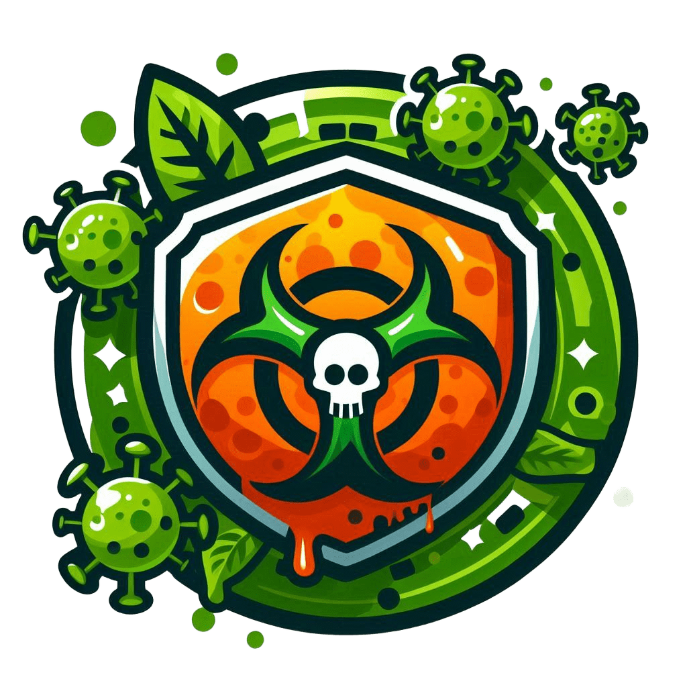
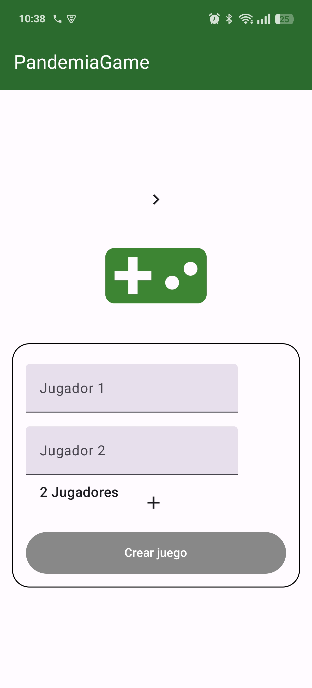
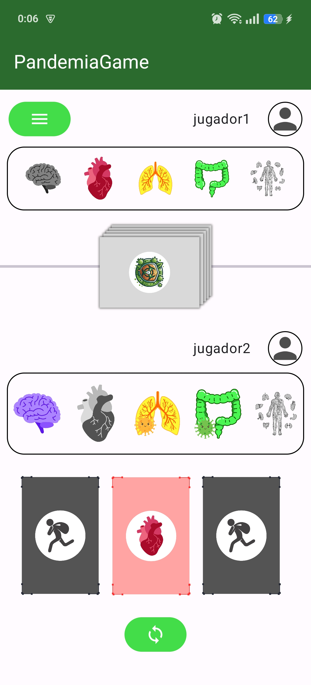
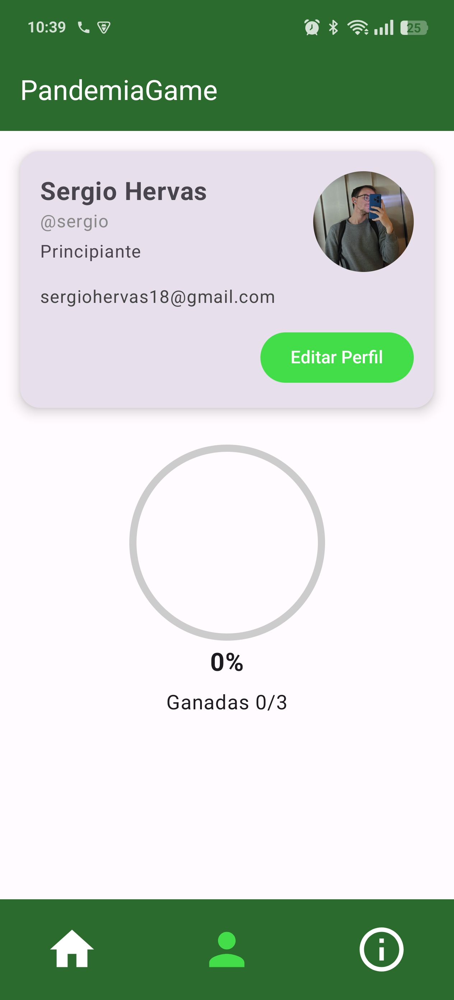
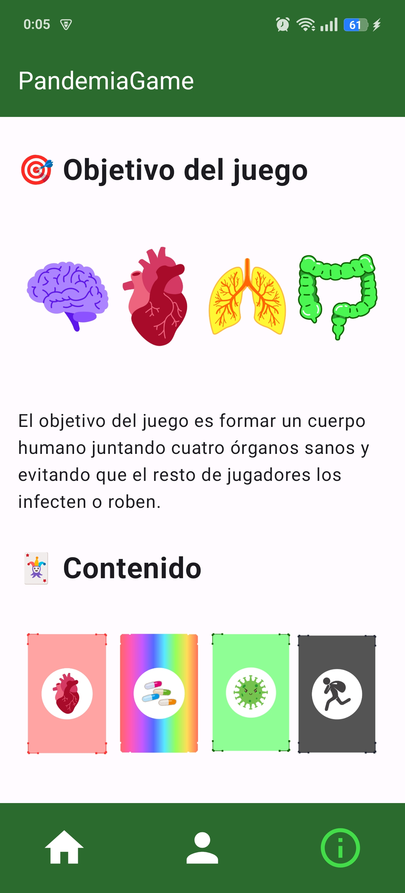

# PandemiaGame - Juego de Cartas Digital  

<p align="center">
    
</p>

**GESTIÓN DE INFORMACIÓN EN DISPOSITIVOS MÓVILES**  
**Máster en Ingeniería Informática en la Universidad de Granada**  

---

## 📜 Descripción  
**PandemiaGame** es una adaptación digital del popular juego de cartas *Virus!*, diseñada para dispositivos móviles. La aplicación permite jugar partidas multijugador, tanto en un solo dispositivo como en línea, respetando las reglas originales del juego mientras añade funcionalidades digitales como:  
✔ **Sistema de recomendación de jugadas** (basado en ML con Random Forest)  
✔ **Historial de partidas y movimientos**  
✔ **Estadísticas de jugadores**  
✔ **Interfaz intuitiva y accesible**  

---

## 🛠 Tecnologías Utilizadas  

### Frontend (Android)  
- **Kotlin** + **Jetpack Compose** (UI declarativa)  
- **Retrofit** (comunicación con API)  
- **MVVM** (arquitectura limpia)  

### Backend (API REST)  
- **Python** + **FastAPI** (servidor rápido y asíncrono)  
- **PostgreSQL** (base de datos relacional)  
- **SQLAlchemy** (ORM) + **Alembic** (migraciones)  

### Machine Learning (Recomendación de jugadas)  
- **Scikit-learn** (Random Forest Classifier)  

### DevOps & Herramientas  
- **GitHub** control de versiones  
- **Swagger** (documentación de API)  
- **Draw.io** (diagramas)  

---

## 🎮 Funcionalidades principales  

| Categoría       | Detalles |  
|-----------------|----------|  
| **Gestión de partidas** | Crear partidas multijugador (2-5 jugadores), continuar partidas guardadas, modo multidispositivo. |  
| **Motor de juego** | Validación automática de reglas, gestión de turnos, detección de victoria (4 órganos sanos). |  
| **Cartas y órganos** | Infectar/curar órganos, robar cartas, intercambiar órganos, usar cartas especiales. |  
| **Usuarios** | Registro, autenticación JWT, perfiles con estadísticas, edición de información. |  
| **Extra** | Tutorial interactivo, historial de movimientos, recomendación de jugadas (IA). |  

---

## 📂 Estructura del proyecto  
```plaintext
PandemiaGame/
├── api/                # FastAPI + PostgreSQL
│   ├── routers/            # Endpoints definidos
│   ├── crud/               # Lógica de negocio
│   ├── models/             # Entidades de la DB
├   ├── schemas/            # Datos para serializar
│   └── migrations/         # Alembic (esquema de DB)
├── android-app             # Android (Kotlin)
│   ├── data/               # Repositorios y modelos
│   ├── ui/                 # Pantallas y componentes
├── docs/                   # Diagramas técnicos y memoria
└── README.md               # Este archivo
```

## 🚀 Cómo ejecutarlo
### Backend
- Instalar dependencias manualmente:
   ```bash
   pip install fastapi uvicorn sqlalchemy alembic psycopg2-binary python-multipart scikit-learn
   ```

- Configurar PostgreSQL en backend/database.py.

- Ejecutar servidor:
    ```bash
    uvicorn main:app --reload
    ```

### Frontend (Android)
- Abrir el proyecto en Android Studio.
- Configurar la URL base de la API en RetrofitClient.kt.

## 📊 Diagramas técnicos
- Diagrama ER: Modelo de base de datos (docs/img/ER_diag.png)
- Diagramas de Clases: Estructura del código (docs/img/class_dia/)
- Diagramas de Secuencia: Secuencias de comunicaciones entre usuario, app y servidor (docs/img/sec_dia/)

## 📊 Capturas de pantalla
A continuación se muestran algunas pantallas del juego
<p align="center">
    
    
    
    
</p>


## 📌 Mejoras futuras
- Chat en partida
- Sistema de logros
- Más expansiones de cartas
- Mejoras técnicas